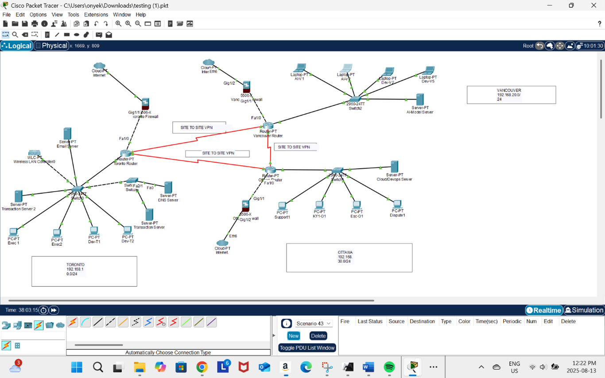
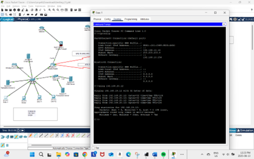
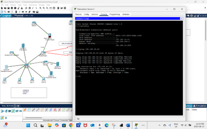

# 🏦 Conestransfer Cybersecurity Project – CIA Response Plan

## 📌 Project Overview
This project simulates the security design of **Conestransfer Inc.**, a fictitious Canadian financial technology (FinTech) company specializing in money transfers. The company operates across **Toronto (HQ)**, **Vancouver**, and **Ottawa**, with 150 employees.  

The goal of the project was to design and analyze the company’s **network infrastructure** and apply the **Confidentiality, Integrity, and Availability (CIA) triad** to protect its critical assets. We also evaluated **threats, vulnerabilities, mitigations, and team structures (Red/Blue/Purple Teams)** to strengthen Conestransfer’s security posture.

---

## ⚙️ Company Profile
- **Industry:** FinTech (Money Transfers & AI-driven Fraud Detection)  
- **Employees:** 150  
- **Offices:** Toronto (HQ), Vancouver, Ottawa  
- **Key Services:**  
  - Peer-to-Peer Payments (real-time, biometric authentication)  
  - AI-driven Fraud Detection & MicroInvest platform  
  - Business Hub for SMEs (invoicing, payroll, AML monitoring)  

---

## 🛠️ Key Assets & Risk Prioritization
| Asset              | Threats                  | CIA Priority | Risk Level | Mitigation Strategies |
|--------------------|--------------------------|--------------|------------|-----------------------|
| Customer PII       | Phishing, Insider Threats| Confidentiality | High | AES-256 encryption, RBAC, employee training |
| Transaction Servers| DDoS, Ransomware         | Availability   | High | Air-gapped backups, Zero Trust, DDoS protection |
| API Gateways       | SQL Injection, API Abuse | All CIA       | Medium | OAuth 2.0, rate limiting, pen testing |
| AI Algorithms      | Model Poisoning          | Integrity     | Low | Code signing, monitoring, sandbox testing |

---

## 🌐 Network Topology
The Conestransfer enterprise network was modeled in **Cisco Packet Tracer** using a **hub-and-spoke VPN architecture**:  

- **Toronto HQ (192.168.10.0/24):** Core services (DNS/DHCP, Email, Transaction Servers, SOC team).  
- **Vancouver Office (192.168.20.0/24):** AI/ML fraud detection servers, software engineers.  
- **Ottawa Office (192.168.30.0/24):** DevOps server (CI/CD for AWS/Azure) and bilingual support center.  

🔐 **Connectivity:** Offices are linked by **IPSec Site-to-Site VPNs** with AES-256 encryption.  
🛡️ **Security Layers:** Cisco ASA Firewalls, IDS/IPS, VLAN segmentation.  

---

## 🔒 CIA Protections
**Confidentiality**  
- AES-256 for data at rest, TLS/IPSec for transit.  
- MFA, RBAC, and SSH key authentication.  
- VLAN segmentation, ACLs, DNSSEC, API token rotation.  

**Integrity**  
- Digital signatures, file integrity monitoring (FIM).  
- SPF/DKIM/DMARC for email validation.  
- Immutable SIEM logs and change approval workflows.  

**Availability**  
- Redundant servers (DNS/DHCP, email, transaction).  
- DDoS protection with rate limiting & IPS.  
- RAID storage, UPS backup, failover VPN routes, load balancing.  

---

## ⚠️ Threats & Mitigation
- **Transaction Servers:** SQL injection, brute force → input validation, WAF, MFA.  
- **Email Systems:** Phishing, ransomware → awareness training, spam filters, DKIM/SPF.  
- **DNS/DHCP:** Cache poisoning, amplification → DNSSEC, query rate limiting.  
- **VPNs:** Weak PSKs, replay attacks → certificate-based auth, strong ciphers, MFA.  
- **AI Servers:** Model poisoning, adversarial inputs → sandbox testing, monitoring.  

---

## 👩‍💻 Cybersecurity Team Structure
- **Blue Team (Defense & Monitoring):** SIEM monitoring, patching, VPN tunnel health, backups, IR protocols.  
- **Red Team (Offensive Testing):** Penetration tests, phishing simulations, misconfiguration checks.  
- **Purple Team (Coordination):** Bridge between Red & Blue, run tabletop exercises, SOC drills, metrics.  

This **three-team model** ensures proactive defense, rapid response, and continuous improvement.  

---

## 📷 Screenshots
  
*Figure 1: Enterprise network topology with IPSec site-to-site VPN connections (Toronto, Vancouver, Ottawa)*

  
*Figure 2: Successful ICMP ping confirming VPN tunnel between Toronto and Vancouver*

  
*Figure 3: Ping from Toronto Transaction Server to Ottawa DevOps Server across VPN*

---

## 📑 Full Report
The complete documentation is available in the [Project Report](docs/Conestransfer_Project_Report.pdf).  

---

## 🏆 Key Takeaways
- Designed a **secure, multi-site FinTech network** using Cisco Packet Tracer.  
- Applied the **CIA triad** to prioritize risks and protections.  
- Analyzed **threats and vulnerabilities** across critical assets.  
- Proposed a layered security approach supported by **Red/Blue/Purple teams**.  

---

## 📖 References
- OWASP Foundation. (2023). *OWASP Top 10 Web Application Security Risks*. https://owasp.org/www-project-top-ten/  
- MITRE ATT&CK. (2023). *Enterprise Techniques & Mitigations*. https://attack.mitre.org/  
- CISA. (2021). *Protecting VPNs and Remote Access*. https://www.cisa.gov  
- NIST. (2022). *SP 800-53r5 Security & Privacy Controls*. https://csrc.nist.gov/publications/detail/sp/800-53/rev-5/final  
- Akiode, H. (2024). *Regulatory Compliance for Fintech Startups in Canada*. Youverify Blog.  
